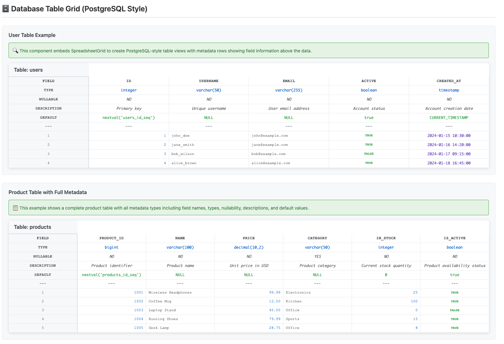

# 협업 데이터 모델링 스프레드시트 / Collaborative Data Modeling Spreadsheet

Go, HTMX, templ, Tailwind CSS로 구축된 협업 데이터 모델링 및 스프레드시트 사용자 인터페이스 애플리케이션입니다.

A collaborative data modeling and spreadsheet user interface application built with Go, HTMX, templ, and Tailwind CSS.

## 📋 핵심 기능

### 📊 **데이터 모델링 스프레드시트**
협업을 위한 인터랙티브 데이터 그리드 시스템
- **실시간 셀 편집**: 클릭-투-에디트 방식의 직관적인 데이터 입력
- **구조화된 그리드**: Excel 스타일의 컬럼/로우 라벨링 시스템 (A, B, C...)
- **반응형 UI**: 다양한 화면 크기에 최적화된 인터페이스
- **키보드 네비게이션**: 효율적인 데이터 입력을 위한 단축키 지원

### 🗃️ **데이터베이스 테이블 그리드**
구조화된 데이터 관리를 위한 고급 컴포넌트
- **테이블 뷰**: 데이터베이스 스타일의 테이블 인터페이스
- **정렬 및 필터링**: 대용량 데이터 탐색 지원
- **셀 포맷팅**: 다양한 데이터 타입별 시각화
- **컬럼 관리**: 동적 컬럼 추가/제거/재정렬

*PostgreSQL 스타일의 메타데이터가 포함된 테이블 그리드 컴포넌트*

### 🎮 **UI/UX 데모 (테트리스)**
WebAssembly 성능 및 UI 반응성 시연
- **실시간 렌더링**: 60fps 게임 루프 구현
- **이벤트 처리**: 키보드 입력의 즉시 반응
- **상태 관리**: 복잡한 게임 상태의 효율적 관리
- **컴포넌트 시스템**: 재사용 가능한 UI 컴포넌트 아키텍처

## 🛠️ 기술 스택

- **언어**: Go (Golang)
- **프론트엔드**: HTMX, templ (Go templating package)
- **백엔드**: Go HTTP 서버
- **스타일링**: Tailwind CSS

## ✨ 주요 특징

- **🚀 고성능 백엔드**: Go 기반의 빠른 서버사이드 렌더링 및 로직 처리
- **🤝 협업 중심 설계**: 다중 사용자 데이터 편집을 염두에 둔 아키텍처
- **🔒 타입 안전 데이터**: Go의 강타입 시스템을 통한 데이터 무결성 보장
- **🎯 직관적 UX**: HTMX를 통한 동적이고 반응적인 인터페이스
- **📊 확장 가능한 모델링**: 다양한 데이터 구조 및 관계 표현 지원

## 🎯 프로젝트 목적

이 프로젝트는 **협업 데이터 모델링**을 위한 차세대 스프레드시트 인터페이스 개발을 목표로 합니다.
Go와 HTMX의 조합을 통해 기존 클라이언트 사이드 복잡성을 줄이고,
데이터 분석가, 개발자, 비즈니스 사용자들이 함께 효율적으로 데이터를 모델링할 수 있는 플랫폼을 제공합니다.