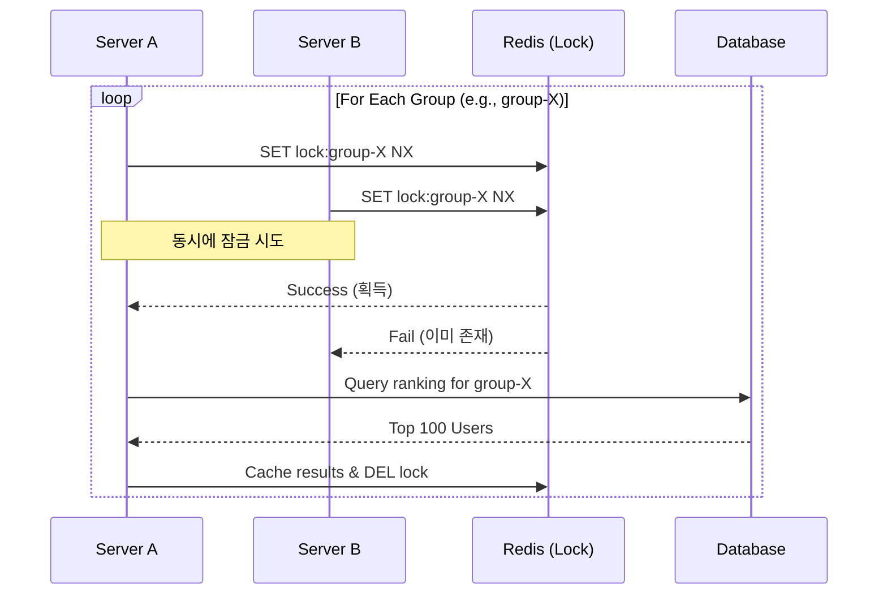
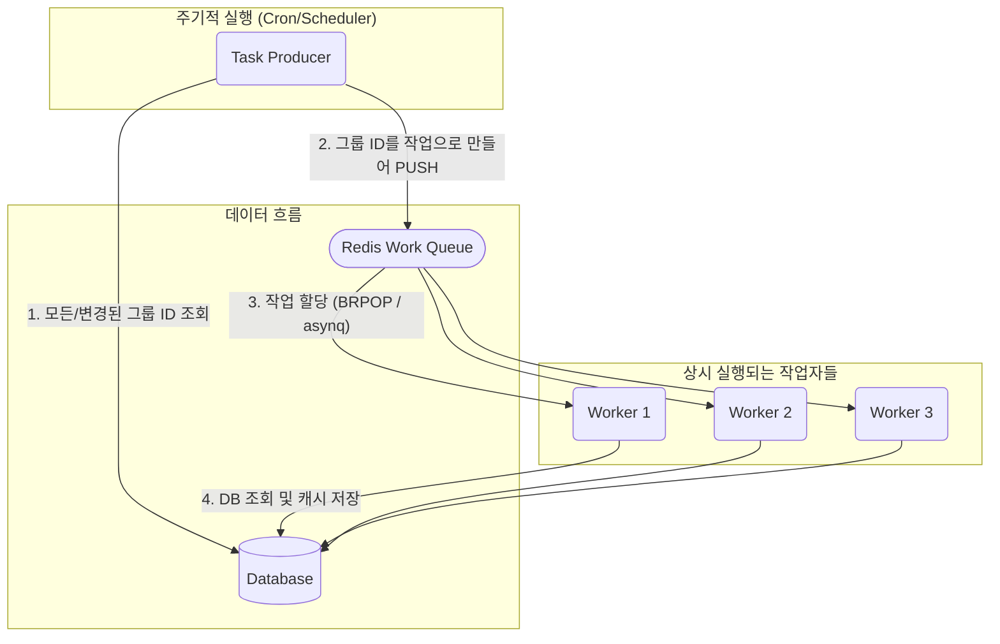
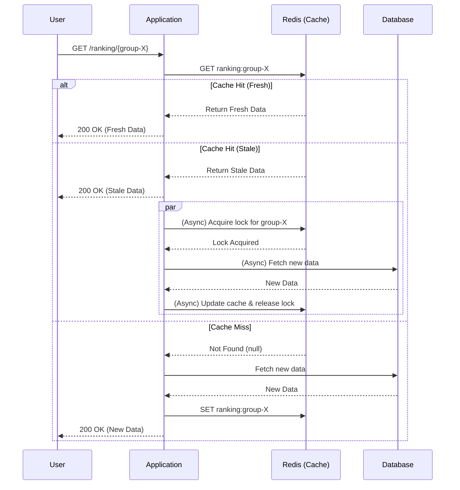

# 분산 환경 랭킹 시스템 아키텍처 비교

## 서론

분산 환경에서 여러 서버가 1분마다 특정 그룹의 랭킹 Top 100을 Redis에 캐싱하는 작업을 안정적이고 효율적으로 수행하기 위한 세 가지 아키텍처 패턴을 비교하고 분석합니다. 각 패턴은 서로 다른 트레이드오프를 가지므로, 비즈니스 요구사항과 시스템의 특성에 맞는 최적의 아키텍처를 선택하는 데 도움을 주는 것을 목표로 합니다.

---

## 아키텍처 1: 샤딩된 잠금 패턴 (경쟁 기반)

### 개요
가장 간단한 분산 처리 방식입니다. 모든 서버(작업자)가 전체 작업 목록(모든 그룹)을 각자 순회하며, 작업의 최소 단위(그룹)마다 개별적인 분산 잠금을 획득하기 위해 경쟁합니다. 잠금을 획득한 작업자만 해당 작업을 처리하고, 실패한 작업자는 즉시 다음 작업으로 넘어갑니다.

### 장점
*   **단순한 구조**: 로직이 직관적이고, 별도의 코디네이터나 복잡한 시스템 없이 Redis의 `SETNX`만으로 쉽게 구현할 수 있습니다.
*   **높은 안정성**: 특정 서버에 장애가 발생해도 다른 서버들이 즉시 해당 작업을 가져가 처리하므로, 단일 장애점(SPOF)이 없습니다.
*   **탄력적 확장**: 새로운 서버를 추가하면 별도의 설정 없이 즉시 작업 경쟁에 참여하여 부하를 분산시킵니다.

### 단점
*   **잠금 경쟁 비용**: 그룹 수가 매우 많아지면, 다수의 서버가 동시에 수많은 잠금을 시도하고 대부분 실패하므로 Redis에 대한 네트워크 트래픽과 부하가 증가합니다.
*   **비효율적인 순회**: 모든 작업자가 항상 전체 그룹 목록을 순회해야 하므로, 애플리케이션 레벨에서 불필요한 반복이 발생합니다.
*   **불균등한 부하**: 서버의 상태나 네트워크 상황에 따라 특정 서버가 더 많은 일을 하게 될 수 있습니다.

### 관계도 (Mermaid)

---

## 아키텍처 2: 사전 캐싱 (큐 기반)

### 개요
작업을 생성하는 '생성자(Producer)'와 작업을 처리하는 '소비자(Consumer)'의 역할을 명확히 분리하는 패턴입니다. 단 하나의 생성자가 주기적으로 처리해야 할 작업 목록을 생성하여 작업 큐(Redis List)에 넣으면, 여러 소비자들이 큐에서 작업을 꺼내 병렬로 처리합니다. `go-asynq`와 같은 전문 라이브러리를 사용하면 이 패턴을 훨씬 더 안정적으로 구현할 수 있습니다.

### 장점
*   **높은 확장성**: 작업자(소비자) 서버를 추가하는 것만으로 전체 처리량이 선형적으로 증가합니다.
*   **효율적인 자원 사용**: 잠금 경쟁이 없으며, 작업자는 할당된 일만 처리하므로 불필요한 리소스 낭비가 없습니다.
*   **안정적인 작업 처리**: `go-asynq`와 같은 라이브러리 사용 시, 실패한 작업에 대한 자동 재시도, 데드 레터 큐 등 신뢰성 높은 작업 처리가 보장됩니다.
*   **최적화 용이**: 생성자 로직에 'Dirty Set'이나 '배치 처리' 같은 고급 최적화 기법을 적용하기 용이합니다.

### 단점
*   **구조의 복잡성**: 단순 경쟁 패턴에 비해, 큐 시스템과 생성자/소비자 로직 등 초기 구현에 더 많은 요소가 필요합니다.
*   **큐 의존성**: 시스템 전체가 작업 큐(Redis)의 안정성에 크게 의존하게 됩니다.

### 관계도 (Mermaid)

---

## 아키텍처 3: 조회 시점 캐싱 (Stale-While-Revalidate)

### 개요
백그라운드에서 미리 캐시를 만들어두지 않고, 사용자의 요청이 들어오는 시점에 캐시를 생성하는 '게으른(lazy)' 방식입니다. 캐시 스탬피드 문제를 해결하고 사용자 경험을 극대화하기 위해 Stale-While-Revalidate(SWR) 전략을 결합합니다. 즉, 오래된(Stale) 데이터가 있다면 일단 즉시 반환하여 사용자를 기다리게 하지 않고, 백그라운드에서 새로운 데이터로 캐시를 갱신합니다.

### 장점
*   **최고의 자원 효율성**: 실제로 요청이 들어온 그룹에 대해서만 캐시를 생성하고 DB 조회를 하므로, 유휴 상태의 그룹에 대한 자원 낭비가 전혀 없습니다.
*   **단순한 아키텍처**: 복잡한 백그라운드 작업 큐나 스케줄러 시스템이 필요 없어 구조가 매우 단순합니다.
*   **항상 빠른 응답 (SWR 적용 시)**: SWR 전략 덕분에 캐시가 오래된 경우에도 사용자는 기다림 없이 즉각적인 응답을 받을 수 있습니다.

### 단점
*   **구현 복잡도 (API 레벨)**: API 엔드포인트 핸들러 내부에 캐시 상태(Fresh/Stale/Miss)를 확인하고, 분산 잠금을 통해 갱신을 처리하는 등 상대적으로 복잡한 로직이 필요합니다.
*   **데이터 신선도 변동**: 사전 캐싱 방식과 달리, 사용자에 따라 보는 데이터의 신선도가 미세하게 다를 수 있습니다.
*   **느린 최초 요청**: 캐시가 아예 없는 상태에서의 최초 요청은 DB 조회 시간만큼의 지연이 반드시 발생합니다. (DB 조회가 매우 빠르다면 단점이 상쇄됨)

### 관계도 (Mermaid)

---

### 최종 비교 및 추천

| 우선순위 | 추천 아키텍처 | 이유 |
| :--- | :--- | :--- |
| **개발 속도 및 단순성** | **1. 샤딩된 잠금** | 가장 빠르게 구현할 수 있고 구조가 단순함. 그룹 수가 적을 때 효과적. |
| **안정성 및 확장성** | **2. 사전 캐싱 (큐 기반)** | `go-asynq` 등 라이브러리 사용 시, 안정적인 분산 처리와 향후 기능 확장이 가장 용이함. |
| **자원 효율성 및 빠른 DB** | **3. 조회 시점 캐싱 (SWR)** | DB 조회가 매우 빠르고, 요청이 없는 그룹이 많을 때 최고의 효율을 보임. |

**종합 추천**:
"1분 지연된 랭킹"이라는 초기 요구사항과 향후 확장성을 고려했을 때, **아키텍처 2: 사전 캐싱 (큐 기반)** 방식이 가장 균형 잡힌 선택입니다. 여기에 'Dirty Set'과 '배치 처리' 최적화를 추가하면, 안정성과 효율성을 모두 갖춘 훌륭한 프로덕션급 시스템을 구축할 수 있습니다.