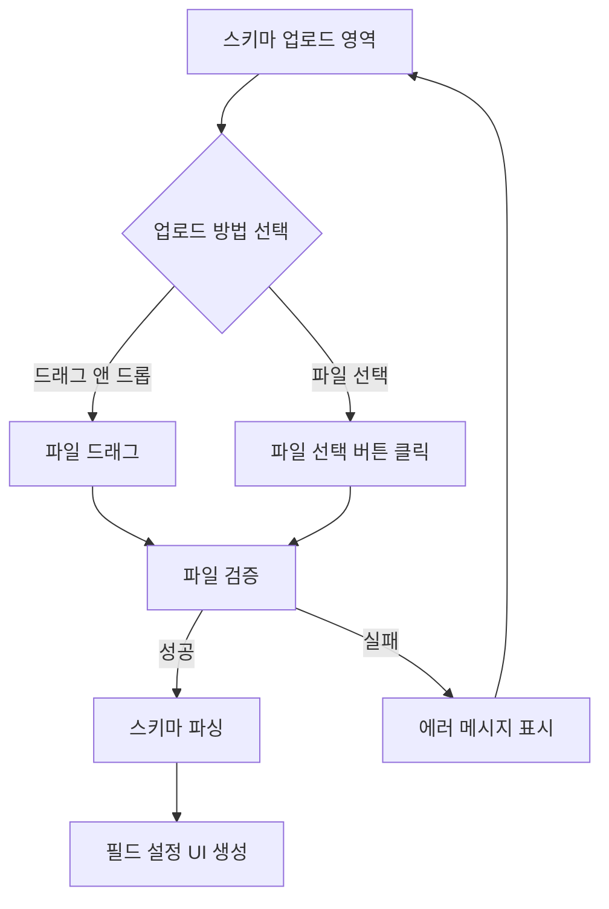
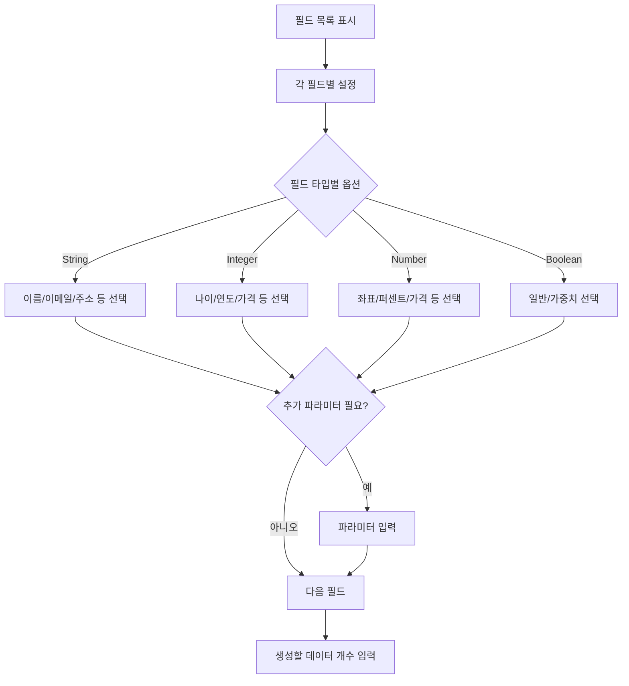
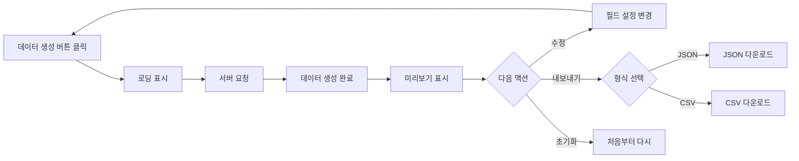
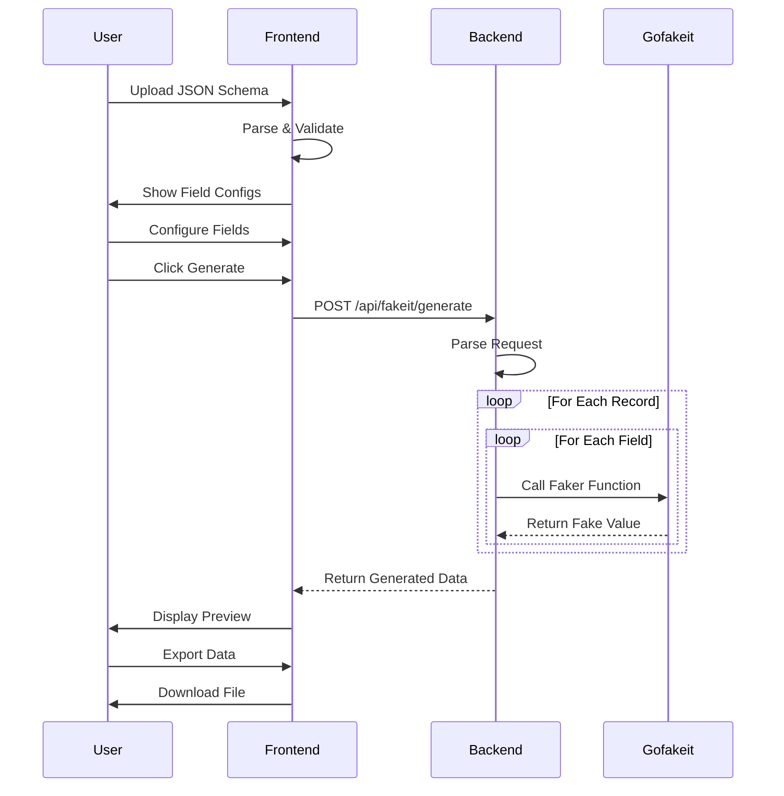

# 더미 데이터 생성기 (Fakeit Generator) 플로우 문서

## 목차
1. [개요](#개요)
2. [유저 플로우](#유저-플로우)
3. [시스템 처리 플로우](#시스템-처리-플로우)
4. [기술 스택](#기술-스택)
5. [주요 기능](#주요-기능)
6. [개선 제안 사항](#개선-제안-사항)

---

## 개요

더미 데이터 생성기는 JSON Schema를 기반으로 실제와 같은 가짜 데이터를 생성하는 도구입니다. 
사용자는 스키마를 업로드하고, 각 필드에 대한 데이터 타입을 선택한 후, 원하는 개수만큼 데이터를 생성할 수 있습니다.

### 핵심 가치
- **편의성**: 드래그 앤 드롭으로 간편한 스키마 업로드
- **유연성**: 필드별 세부 데이터 타입 선택 가능
- **실용성**: 실제와 같은 현실적인 데이터 생성
- **확장성**: 새로운 데이터 타입 쉽게 추가 가능

---

## 유저 플로우

### 1. 진입 및 준비 단계

```mermaid
graph LR
    A[메인 페이지] --> B[사이드바: 더미 데이터 클릭]
    B --> C[/fakeit 페이지 진입]
    C --> D{JSON Schema 준비}
    D -->|있음| E[파일 업로드]
    D -->|없음| F[샘플 스키마 다운로드]
    F --> E
```

### 2. 스키마 업로드 단계



### 3. 필드 설정 단계



### 4. 데이터 생성 및 활용 단계



### 5. 상세 유저 시나리오

#### 시나리오 1: 전자상거래 테스트 데이터 생성
1. 사용자가 상품 정보 스키마 업로드
2. `productName` → "회사명" 선택 (실제 회사 이름 생성)
3. `price` → "가격" 선택 (1,000~100,000 범위)
4. `inStock` → "가중치 불린" 선택 (80% true)
5. 1000개 데이터 생성
6. CSV로 내보내기 → 엑셀에서 활용

#### 시나리오 2: 사용자 관리 시스템 테스트
1. 사용자 정보 스키마 업로드
2. `name` → "한국 이름" 선택
3. `email` → "이메일" 선택
4. `phone` → "전화번호" 선택
5. `age` → "나이" 선택 (18~80 범위)
6. 500개 데이터 생성
7. JSON으로 내보내기 → API 테스트에 활용

---

## 시스템 처리 플로우

### 1. 프론트엔드 처리 (JavaScript)

```javascript
// 전체 처리 흐름
START
  ↓
[파일 업로드 이벤트]
  ↓
parseSchemaFile()
  ├─ JSON 파싱
  ├─ 스키마 검증
  └─ 필드 추출
  ↓
generateFieldConfigs()
  ├─ 타입별 옵션 매핑
  ├─ UI 컴포넌트 생성
  └─ 이벤트 리스너 등록
  ↓
[사용자 설정 입력]
  ↓
collectFieldConfigurations()
  ├─ 각 필드 설정 수집
  ├─ 파라미터 수집
  └─ 검증
  ↓
generateData()
  ├─ API 요청 준비
  ├─ POST /api/fakeit/generate
  └─ 응답 처리
  ↓
displayGeneratedData()
  ├─ 테이블 렌더링
  ├─ 스키마 순서 유지
  └─ 페이지네이션
  ↓
END
```

### 2. 백엔드 처리 (Go)

```go
// 서버 측 처리 흐름
START
  ↓
FakeitGenerateAPIHandler()
  ├─ 요청 파싱
  ├─ 검증 (스키마, 개수)
  └─ generateFakeData() 호출
  ↓
generateFakeData()
  ├─ 스키마 properties 추출
  ├─ 필드 순서 보존
  └─ Loop: count만큼 반복
      ↓
    generateFieldValue()
      ├─ 타입별 분기
      ├─ Gofakeit 함수 호출
      └─ 값 반환
  ↓
[JSON 응답 생성]
  ↓
END
```

### 3. 데이터 타입 매핑 구조

```yaml
Client (JavaScript):
  fakeDataTypes:
    string:
      - name: "이름"
      - email: "이메일"
      - phone: "전화번호"
      - address: "주소"
      - company: "회사명"
      - custom: "커스텀"
    
    integer:
      - age: "나이"
      - year: "연도"
      - price: "가격"
      - custom: "커스텀 범위"
    
    number:
      - float: "소수"
      - latitude: "위도"
      - longitude: "경도"
      - percentage: "퍼센트"
    
    boolean:
      - boolean: "일반"
      - weighted: "가중치"

Server (Go):
  generateStringValue():
    - "name" → gofakeit.Name()
    - "email" → gofakeit.Email()
    - "phone" → gofakeit.Phone()
    - "address" → gofakeit.Address()
    - "company" → gofakeit.Company()
    - "custom" → RandomString(userValues)
```

### 4. 데이터 흐름 다이어그램



---

## 기술 스택

### Frontend
- **템플릿 엔진**: Templ (Go 템플릿)
- **JavaScript**: Vanilla JS (프레임워크 없음)
- **CSS**: Tailwind CSS
- **파일 처리**: FileReader API
- **드래그 앤 드롭**: HTML5 Drag and Drop API

### Backend
- **언어**: Go 1.21+
- **라우팅**: net/http (표준 라이브러리)
- **Fake 데이터**: gofakeit v7
- **JSON 처리**: encoding/json

### 데이터 포맷
- **입력**: JSON Schema (Draft-07 호환)
- **출력**: JSON, CSV

---

## 주요 기능

### 현재 구현된 기능

#### 1. 스키마 처리
- ✅ JSON Schema 업로드 및 파싱
- ✅ 드래그 앤 드롭 지원
- ✅ 파일 크기 제한 (5MB)
- ✅ 스키마 유효성 검증

#### 2. 데이터 타입 지원
- ✅ String (19가지 하위 타입)
- ✅ Integer (9가지 하위 타입)
- ✅ Number (6가지 하위 타입)
- ✅ Boolean (2가지 하위 타입)

#### 3. 커스터마이징
- ✅ 필드별 활성화/비활성화
- ✅ 커스텀 값 목록
- ✅ 범위 지정 (min/max)
- ✅ 가중치 불린 (확률 설정)

#### 4. 데이터 생성
- ✅ 최대 10,000개 레코드 생성
- ✅ 스키마 필드 순서 유지
- ✅ 실시간 미리보기 (20개 행)

#### 5. 내보내기
- ✅ JSON 형식 다운로드
- ✅ CSV 형식 다운로드
- ✅ 필드 순서 보존

---

## 개선 제안 사항

### 1. 🎯 즉시 구현 가능한 개선사항

#### 1.1 스마트 타입 추천
```javascript
// 필드명 기반 자동 타입 선택
const smartTypeMapping = {
    'email': 'email',
    'phone': 'phone',
    'tel': 'phone',
    'age': 'age',
    'name': 'name',
    'address': 'address',
    'company': 'company',
    'url': 'url',
    'website': 'url',
    'price': 'price',
    'created': 'date',
    'updated': 'date'
};
```

#### 1.2 한국 데이터 지원
- 한국 이름 생성
- 한국 주소 (시/도, 구/군)
- 한국 전화번호 형식
- 한국 회사명
- 주민등록번호 형식 (마스킹)

#### 1.3 프리셋 템플릿
```javascript
const presetTemplates = {
    'ecommerce': {
        name: '전자상거래',
        fields: ['상품명', '가격', '재고', '카테고리']
    },
    'user': {
        name: '사용자 관리',
        fields: ['이름', '이메일', '전화번호', '주소']
    },
    'blog': {
        name: '블로그 포스트',
        fields: ['제목', '내용', '작성자', '작성일']
    }
};
```

### 2. 🚀 고급 기능 개선

#### 2.1 관계형 데이터 생성
```yaml
기능: 연관된 데이터 생성
예시:
  - User와 Order 테이블 동시 생성
  - Foreign Key 관계 유지
  - 일관된 ID 참조
```

#### 2.2 시계열 데이터 생성
```yaml
기능: 시간 순서가 있는 데이터
예시:
  - 로그 데이터 (timestamp 순서)
  - 거래 내역 (날짜 순서)
  - 센서 데이터 (시간 간격)
```

#### 2.3 데이터 패턴 설정
```javascript
patterns: {
    'sequential': '순차 증가',
    'random': '완전 랜덤',
    'gaussian': '정규 분포',
    'weighted': '가중치 분포',
    'unique': '중복 없음'
}
```

### 3. 🎨 UX/UI 개선

#### 3.1 실시간 프리뷰
- 설정 변경 시 즉시 샘플 데이터 1개 표시
- 타입 변경 시 예시 값 실시간 업데이트

#### 3.2 일괄 설정
- 모든 string 필드 → 한번에 같은 타입 설정
- 정규식 매칭으로 필드 그룹 설정

#### 3.3 설정 저장/불러오기
- 필드 설정을 프로필로 저장
- 자주 사용하는 설정 재사용

### 4. 🔧 기술적 개선

#### 4.1 성능 최적화
```javascript
// Web Worker를 사용한 대량 데이터 처리
const worker = new Worker('fakeit-worker.js');
worker.postMessage({ schema, count: 10000 });
```

#### 4.2 검증 강화
```javascript
// JSON Schema 제약조건 준수
- minLength, maxLength
- minimum, maximum
- pattern (정규식)
- enum 값 제한
- required 필드 보장
```

#### 4.3 API 개선
```yaml
Batch API:
  POST /api/fakeit/batch
  - 여러 스키마 동시 처리
  - 압축 응답 지원
  
Stream API:
  GET /api/fakeit/stream
  - Server-Sent Events
  - 대량 데이터 스트리밍
```

### 5. 📊 데이터 품질 개선

#### 5.1 일관성 규칙
- 이메일과 이름 연관성 (john.doe@example.com)
- 나이와 생년월일 일치
- 주소 구성요소 일관성

#### 5.2 현실성 향상
- 실제 데이터 분포 반영
- 계절성/트렌드 반영
- 비즈니스 규칙 적용

#### 5.3 데이터 마스킹
- 민감정보 자동 마스킹
- GDPR 준수 옵션
- 개인정보 익명화

### 6. 🔌 통합 기능

#### 6.1 Import 연동
```javascript
// 생성된 데이터를 바로 테이블로 가져오기
const importToTable = async (generatedData) => {
    await fetch('/api/table/import', {
        method: 'POST',
        body: JSON.stringify(generatedData)
    });
};
```

#### 6.2 API 모킹
- OpenAPI/Swagger 스펙 읽기
- REST API 응답 생성
- GraphQL 스키마 지원

#### 6.3 데이터베이스 직접 연동
- PostgreSQL 직접 삽입
- 기존 테이블 구조 읽기
- SQL 스크립트 생성

### 7. 📈 분석 및 모니터링

#### 7.1 사용 통계
- 가장 많이 사용되는 데이터 타입
- 평균 생성 레코드 수
- 자주 사용되는 스키마 패턴

#### 7.2 품질 메트릭
- 데이터 분포 시각화
- 중복률 체크
- 널 값 비율

---

## 구현 우선순위

### Phase 1 (1주일)
1. ✅ 한국 데이터 타입 추가
2. ✅ 스마트 타입 추천
3. ✅ 프리셋 템플릿

### Phase 2 (2주일)
1. ⏳ 실시간 프리뷰
2. ⏳ 설정 저장/불러오기
3. ⏳ 일괄 설정 기능

### Phase 3 (1개월)
1. ⏳ 관계형 데이터 생성
2. ⏳ Web Worker 성능 최적화
3. ⏳ Import 연동

### Phase 4 (장기)
1. ⏳ API 모킹
2. ⏳ 데이터베이스 직접 연동
3. ⏳ 분석 대시보드

---

## 참고 자료

- [JSON Schema Specification](https://json-schema.org/)
- [Gofakeit Documentation](https://github.com/brianvoe/gofakeit)
- [Faker.js](https://fakerjs.dev/) - JavaScript 대안
- [Mockaroo](https://www.mockaroo.com/) - 유사 서비스 참고

---

*Last Updated: 2024*