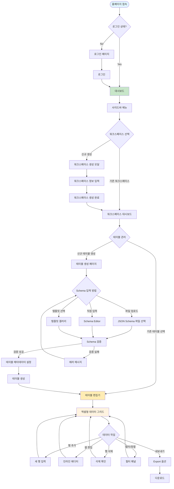
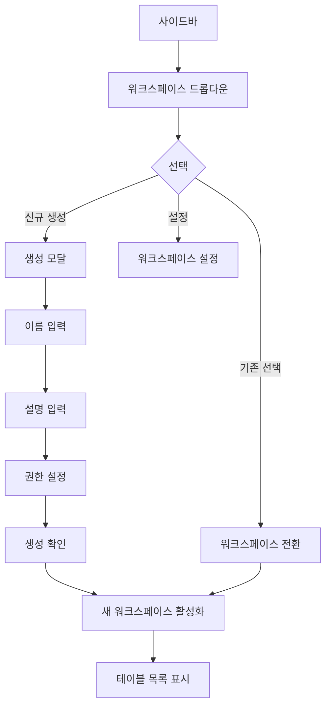
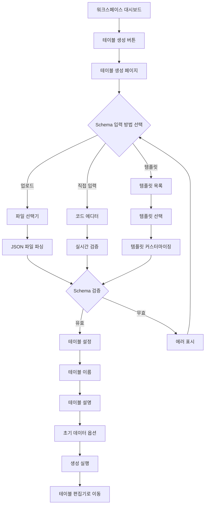
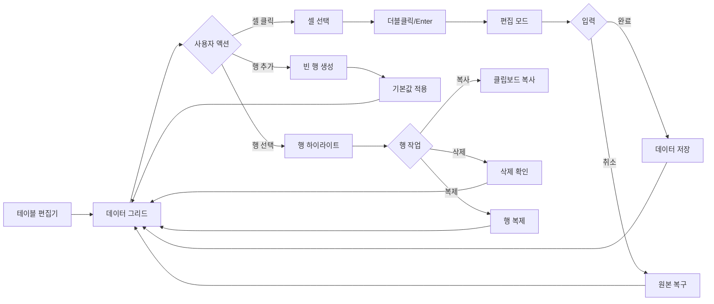
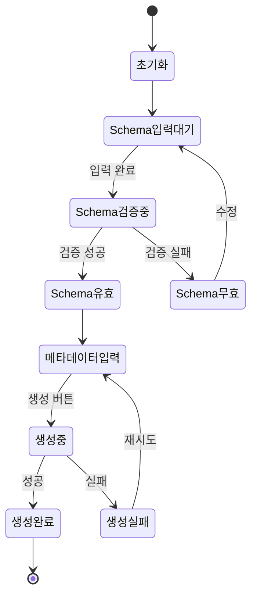
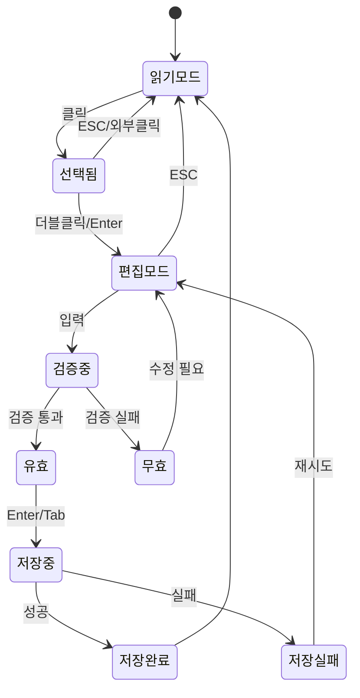
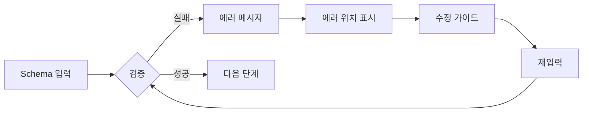

# JSON Schema Table Editor - 유저 플로우 설계

## 📊 전체 유저 플로우 다이어그램



## 🔄 상세 유저 플로우

### 1. 초기 진입 플로우


### 2. 워크스페이스 관리 플로우



### 3. 테이블 생성 플로우



### 4. 데이터 편집 플로우



## 📱 화면별 상세 설계

### 1. 홈페이지 (Landing Page)
```yaml
URL: /
구성요소:
  - 헤더: 로고, 로그인/회원가입 버튼
  - 히어로 섹션: 제품 소개
  - 기능 소개: 주요 기능 3-4개
  - CTA: 시작하기 버튼
상태:
  - 미인증: 로그인/회원가입 표시
  - 인증됨: 대시보드로 리다이렉트
```

### 2. 대시보드
```yaml
URL: /dashboard
구성요소:
  - 사이드바: 워크스페이스 선택기
  - 메인 영역:
    - 최근 작업한 테이블
    - 빠른 액세스
    - 통계 위젯
액션:
  - 워크스페이스 전환
  - 테이블 바로가기
  - 새 테이블 생성
```

### 3. 워크스페이스 대시보드
```yaml
URL: /workspace/{id}
구성요소:
  - 헤더: 워크스페이스 이름, 설정
  - 테이블 그리드:
    - 테이블 카드 (썸네일, 이름, 수정일)
    - 생성 버튼
  - 필터/검색: 테이블 검색
액션:
  - 테이블 생성
  - 테이블 열기
  - 테이블 삭제
  - 테이블 복제
```

### 4. 테이블 생성 페이지
```yaml
URL: /workspace/{id}/table/new
구성요소:
  - Step 1: Schema 입력
    - 탭: 업로드 | 에디터 | 템플릿
    - 검증 상태 표시
  - Step 2: 테이블 설정
    - 이름 입력
    - 설명 입력
    - 옵션 설정
  - 액션 버튼: 취소 | 생성
상태:
  - Schema 미입력
  - Schema 검증 중
  - Schema 유효
  - Schema 무효
```

### 5. 테이블 편집기
```yaml
URL: /workspace/{wid}/table/{tid}
구성요소:
  - 툴바:
    - 행 추가/삭제
    - 필터/정렬
    - 가져오기/내보내기
    - 저장 상태
  - 데이터 그리드:
    - 헤더 행 (컬럼명, 타입)
    - 데이터 행
    - 페이지네이션
  - 사이드 패널:
    - Schema 뷰어
    - 필터 옵션
    - 히스토리
액션:
  - 셀 편집
  - 행 CRUD
  - 필터/정렬
  - 내보내기
  - 실행 취소/다시 실행
```

## 🔀 상태 전이 다이어그램

### 테이블 생성 상태



### 셀 편집 상태



## 🎯 주요 인터랙션 포인트

### 1. 워크스페이스 선택기
```markdown
트리거: 사이드바 드롭다운 클릭
동작:
  1. 드롭다운 메뉴 열기
  2. 워크스페이스 목록 표시
  3. 현재 선택된 항목 하이라이트
  4. "새 워크스페이스" 옵션 표시
피드백:
  - 호버 효과
  - 선택 시 즉시 전환
  - 로딩 인디케이터
```

### 2. Schema 업로드
```markdown
트리거: 파일 선택 또는 드래그 앤 드롭
동작:
  1. 파일 유효성 검사 (.json)
  2. 파일 내용 파싱
  3. Schema 검증
  4. 결과 표시
피드백:
  - 업로드 진행률
  - 성공/실패 메시지
  - 에러 상세 정보
```

### 3. 셀 편집
```markdown
트리거: 셀 더블클릭 또는 F2
동작:
  1. 편집 모드 활성화
  2. 타입별 에디터 표시
  3. 실시간 검증
  4. 저장/취소
피드백:
  - 편집 중 표시 (border)
  - 검증 에러 툴팁
  - 저장 성공 플래시
```

### 4. 행 추가
```markdown
트리거: "행 추가" 버튼 또는 Ctrl+Shift+N
동작:
  1. 새 행 생성
  2. 기본값 적용
  3. 첫 번째 셀 포커스
  4. 편집 모드 진입
피드백:
  - 새 행 하이라이트
  - 스크롤 자동 이동
  - 행 번호 업데이트
```

## 🔒 예외 처리 플로우

### Schema 검증 실패


### 네트워크 오류


## 📝 네비게이션 구조

```
/
├── /login
├── /signup
├── /dashboard
├── /workspace
│   ├── /new
│   └── /{workspace-id}
│       ├── /settings
│       ├── /members
│       └── /table
│           ├── /new
│           └── /{table-id}
│               ├── /edit
│               ├── /schema
│               └── /history
└── /profile
    └── /settings
```

## 🎨 UI 컴포넌트 맵

### 공통 컴포넌트
- Header
- Sidebar
- Breadcrumb
- Modal
- Toast
- Dropdown
- Button
- Input
- FileUpload

### 도메인 컴포넌트
- WorkspaceSelector
- TableCard
- SchemaEditor
- DataGrid
- CellEditor
- FilterPanel
- ExportDialog
- HistoryPanel

## 📱 반응형 고려사항

### Desktop (1920px+)
- 3열 레이아웃 (사이드바 + 메인 + 패널)
- 전체 기능 노출

### Tablet (768px - 1919px)
- 2열 레이아웃 (사이드바 토글 + 메인)
- 주요 기능 우선

### Mobile (< 768px)
- 1열 레이아웃
- 하단 네비게이션
- 읽기 전용 모드 우선
- 제한적 편집 기능

## ✅ 체크포인트

### 사용성 검증
- [ ] 3클릭 이내 주요 작업 도달
- [ ] 명확한 피드백 제공
- [ ] 실행 취소 가능
- [ ] 에러 복구 경로 제공

### 접근성 검증
- [ ] 키보드 네비게이션
- [ ] 스크린 리더 지원
- [ ] 색상 대비 4.5:1 이상
- [ ] 포커스 표시 명확

### 성능 검증
- [ ] 초기 로딩 3초 이내
- [ ] 인터랙션 응답 100ms 이내
- [ ] 10,000행 처리 가능
- [ ] 오프라인 모드 지원